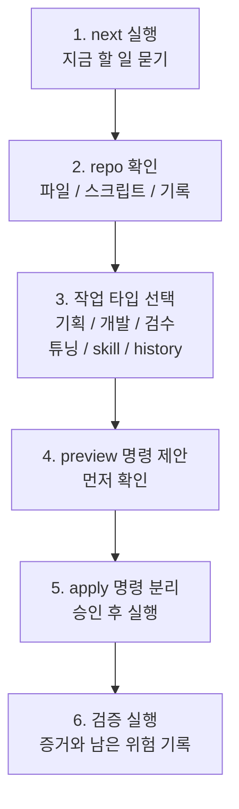

# Repo Harness Tuner

Codex로 프로젝트를 계속 작업하다 보면 이런 순간이 자주 옵니다.

```text
이제 뭘 해야 하지?
검증은 뭘 돌려야 하지?
어디까지 Codex에게 맡겨도 되지?
skill이나 agent를 더 붙여야 하나?
```

Repo Harness Tuner는 이 질문에 답해주는 Codex 작업장 튜너입니다.

처음에는 명령 하나만 기억하면 됩니다.

```powershell
python scripts\console.py next --repo C:\path\to\repo --phase active-development --domain "your project"
```

`next`는 repo를 살펴보고, 지금 Codex가 해야 할 다음 일을 하나로 좁혀줍니다. 분석과 추천은 자동으로 하지만, 파일 쓰기, 정책 변경, 외부 skill 설치는 명시 승인 후에만 합니다.

이 플러그인은 조용히 모든 기획/개발/출시를 대신하는 자동 개발자가 아닙니다. Codex가 기획, 개발, 검수, 문서화, 하네스 정리를 계속 이어가기 좋도록 작업장을 정리해주는 층입니다.

쓰기 작업이 필요할 때도 `next`는 먼저 확인용 preview 명령과 승인 후 apply 명령을 나눠서 보여줍니다. 첫 명령은 계획이나 diff를 보는 용도이고, 두 번째 명령은 사람이 변경을 승인한 뒤에만 실행하는 명령입니다.

[English README](README_EN.md)

## 채팅으로는 이렇게 말하세요

설치된 뒤에는 명령어를 외우지 않아도 됩니다. repo가 열려 있는 Codex 채팅에서 이렇게 말하면 Repo Harness Tuner가 먼저 read-only `next` 흐름으로 들어가도록 설계되어 있습니다.

```text
다음에 뭐해?
기획해줘.
구조 잡아줘.
검수해줘.
완료 기준이랑 승인 지점 잡아줘.
알아서 해줘. 단, 파일 쓰기나 설치는 승인 받고 해.
```

이런 자연어 요청은 곧바로 파일을 고치는 뜻이 아닙니다. 먼저 repo를 살펴보고, 지금 단계가 기획인지, 개발 지원인지, 검수인지, 하네스 튜닝인지, skill 추천인지 판단한 뒤 다음 안전한 행동 하나를 제안합니다.

## 한눈에 보는 흐름



`next`가 보여주는 핵심은 다섯 가지입니다.

- Codex가 repo에서 발견한 것
- 지금 작업 타입
- 먼저 확인할 preview 명령과, 필요할 때만 쓰는 승인 후 apply 명령
- 사람이 승인해야 하는 것
- 실행하거나 기록해야 할 검증

작업 타입은 아래 중 하나로 나옵니다.

| 작업 타입 | 의미 |
| --- | --- |
| `planning` | 방향, 범위, 작업 계약을 잡는 단계 |
| `development-support` | 개발을 더 반복 가능하게 돕는 단계 |
| `review-validation` | 검수, 실패, 증거를 확인하는 단계 |
| `harness-tuning` | repo-local Codex 지침을 조정하는 단계 |
| `skill-recommendation` | 필요한 skill/agent 후보만 좁혀보는 단계 |
| `history` | 다음 실행이 나아지도록 기록을 남기는 단계 |

처음부터 `bootstrap`, `tune`, `factory`, `recommend-skills`, `history`를 고를 필요는 없습니다. `next`로 시작하고, 출력된 승인 경계를 확인한 뒤 추천된 다음 명령만 따라가면 됩니다.

## Codex에서는 이렇게 요청하세요

```text
repo-harness-tuner로 이 repo를 봐줘.
Codex가 다음에 뭘 해야 하는지,
어떤 검증을 해야 하는지,
파일 쓰기나 설치 전에 무엇을 승인해야 하는지 알려줘.
```

CLI에서 짧은 건강 상태만 보고 싶다면 `doctor`를 쓰면 됩니다.

```powershell
python scripts\console.py doctor --repo C:\path\to\repo --phase active-development --domain "your project"
```

## 하네스 계약

하네스를 만든다는 건 Codex에게 “어디까지 맡길지”를 정하는 일입니다. Repo Harness Tuner는 생성하거나 튜닝하는 문서에 네 가지 경계를 남깁니다.

- **Scope**: Codex에게 어디까지 맡길지, 어디부터 맡기지 않을지
- **Access & Actions**: 무엇을 볼 수 있고, 무엇을 할 수 있고, 무엇은 금지되는지
- **Definition of Done**: 무엇을 통과해야 완료로 볼지
- **Human Approval Points**: 언제 사람이 개입해야 하는지

`next`, `doctor`, `run-loop`는 이 내용을 `harness_contract`로 출력하고, `bootstrap`, `tune`, `factory`는 생성 문서에 이 섹션을 씁니다.

## 안전 모델

기본은 read-first입니다.

- `next`, `doctor`, 기본 `run-loop`는 파일을 수정하지 않습니다.
- 파일 쓰기는 `--write`, `--write-plan`, `--write-recommended`, `--write-artifacts` 같은 명시 플래그가 필요합니다.
- skill 설치는 `--install --confirm-install`이 필요합니다.
- human involvement 4 또는 5에서는 `--confirm-write`도 필요합니다.
- dependency, release, CI, secret, credential, marketplace, migration, destructive 변경은 명시 승인 없이는 진행하지 않습니다.
- ECC 후보는 대량 설치하지 않고, 승인된 경우 작은 Codex adapter skill로만 설치합니다.

## 언제 쓰면 좋나

이럴 때 특히 좋습니다.

- 새 repo에 `AGENTS.md`나 `Docs/AI/*`가 필요할 때
- Codex가 너무 자주 묻거나, 반대로 위험한 일을 너무 알아서 하려 할 때
- 검증 명령, ask-before-edit 규칙, worker visibility를 repo에 맞게 정리하고 싶을 때
- 프로젝트별 Codex 팀/skill 설계가 필요할 때
- ECC처럼 큰 외부 세트를 통째로 붙이지 않고, 필요한 skill/agent 후보만 1-3개 보고 싶을 때
- history/eval 기록을 보고 하네스를 계속 조정하고 싶을 때

일반적인 작은 코딩, 디버깅, 리뷰는 repo 하네스가 이미 잘 맞으면 굳이 이 플러그인을 매번 켤 필요는 없습니다.

## 프로젝트가 진행되면

프로젝트가 바뀌면 하네스도 조금씩 바뀌어야 합니다. Repo Harness Tuner는 다음 신호를 봅니다.

- phase별 review cadence
- readiness score 변화
- 반복되는 validation drift
- 반복되는 process overhead
- 반복되는 human-involvement gap
- eval regression 또는 unchanged failure

이 신호가 쌓이면 다음 `next`에서 `tune`, `eval-review`, 더 짧은 review interval, 또는 skill 추천 조정을 제안할 수 있습니다. 다만 cadence나 human-involvement 정책은 자동으로 바꾸지 않고 추천만 합니다.

## Skill 추천

`next`에는 최소 skill 추천도 포함됩니다. 따로 보고 싶으면:

```powershell
python scripts\console.py recommend-skills --repo C:\path\to\repo --phase active-development --domain "your project" --source builtin,ecc
```

추천 대상은 code review, TDD, security, docs, build-fix, frontend-ui, release-check 같은 역량입니다. 추천은 repo 증거 기반으로 1-3개만 보여줍니다.

설치하려면 별도 승인이 필요합니다.

```powershell
python scripts\console.py recommend-skills --repo C:\path\to\repo --install --confirm-install
```

이 설치도 Codex adapter skill만 만듭니다. ECC hooks, MCP 서버, slash command, native agent, marketplace 설정은 자동으로 설치하지 않습니다.

## Human Involvement

human involvement는 Codex가 얼마나 자주 사람에게 물어봐야 하는지를 정합니다.

| Phase | 기본값 |
| --- | ---: |
| `prototype` | 2 |
| `new-project` | 3 |
| `active-development` | 3 |
| `maintenance` | 3 |
| `pre-release` | 4 |
| `high-risk` | 5 |

직접 조정할 수도 있습니다.

```powershell
python scripts\console.py run-loop --repo C:\path\to\repo --human-involvement 4
python scripts\console.py run-loop --repo C:\path\to\repo --module "Release flow: 5"
```

간단히 보면:

- `1`: 보호 영역이 아니면 거의 알아서 진행
- `2`: repo 패턴을 따르고 가정만 보고
- `3`: 일반 작업은 추론, 되돌리기 어렵거나 사용자에게 보이는 방향은 질문
- `4`: 편집 전 짧게 질문
- `5`: 명시 승인 전에는 읽기 중심

## 자주 쓰는 명령

```powershell
python scripts\console.py next --repo C:\path\to\repo --phase active-development --domain "your project"
python scripts\console.py doctor --repo C:\path\to\repo --phase active-development --domain "your project"
python scripts\console.py run-loop --repo C:\path\to\repo --phase active-development --domain "your project"
python scripts\console.py recommend-skills --repo C:\path\to\repo --phase active-development --domain "your project"
python scripts\console.py tune --repo C:\path\to\repo --phase active-development --dry-run --diff
python scripts\console.py bootstrap --repo C:\path\to\repo --phase new-project
python scripts\console.py fixture-test
python scripts\console.py release-check
```

전체 명령과 JSON 예시는 [Docs/commands.md](Docs/commands.md)에 있습니다.

## 설치

처음 설치할 때는 `$HOME\plugins\repo-harness-tuner`에 clone하고 personal marketplace entry를 추가한 뒤 실행합니다.

```powershell
codex plugin add repo-harness-tuner@personal
```

fresh clone, 갱신, 문제 해결, Windows `codex.exe` shim, PyYAML validator, 검증 절차는 [Docs/install.md](Docs/install.md)를 보세요.

## 관련 문서

- English README: [README_EN.md](README_EN.md)
- 설치와 문제 해결: [Docs/install.md](Docs/install.md)
- 전체 명령: [Docs/commands.md](Docs/commands.md)
- CLI 계약: [Docs/cli-contracts.md](Docs/cli-contracts.md)
- 버전/변경 정책: [Docs/versioning.md](Docs/versioning.md)
- Fixture tests: [Docs/fixture-tests.md](Docs/fixture-tests.md)
- 로드맵: [ROADMAP.md](ROADMAP.md)
- 다른 PC/thread에서 이어가기: [HANDOFF.md](HANDOFF.md)
