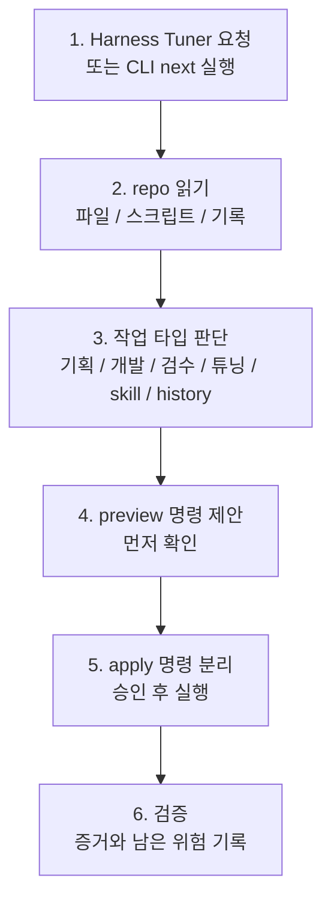

# Harness Tuner

Codex plugin id: `repo-harness-tuner`

Harness Tuner는 Codex에게 “이 프로젝트에서 다음에 뭘 해야 하는지”를 정리해주는 작업장 튜너입니다.

이 플러그인의 목적은 Codex에게 무작정 “알아서 다 해줘”라고 맡기는 것이 아닙니다. 프로젝트마다 **어디까지 맡길지**, **무엇을 보고 실행할 수 있는지**, **무엇을 통과해야 완료인지**, **언제 사람이 승인해야 하는지**를 repo 안에 계속 맞춰두는 것이 목적입니다.

즉 Harness Tuner는 더 많은 자동화를 밀어붙이는 도구라기보다, Codex가 기획, 개발, 검수, 튜닝을 안전하게 이어갈 수 있도록 작업 경계와 다음 행동을 정리하는 도구입니다.

각 repo의 파일, 문서, 검증 명령, 이전 기록을 근거로 다음 작업 흐름을 제안합니다.

> 제품 표시 이름은 **Harness Tuner**로 줄였습니다. GitHub repo, plugin id, 설치 명령은 호환성을 위해 당분간 `repo-harness-tuner`를 유지합니다.

## 채팅에서 먼저 이렇게 말하세요

처음부터 명령어를 외울 필요는 없습니다. Codex에서 repo를 열고 이렇게 말하세요.

```text
Harness Tuner로 이 repo에서 다음에 뭐할지 읽기 전용으로 안내해줘.
창 열기, 테스트 실행, 파일 쓰기, 설치는 하지 말고 preview/apply 경계만 보여줘.
```

짧게 말하고 싶다면 이렇게 붙이면 됩니다.

```text
다음에 뭐해? Harness Tuner로 읽기 전용으로만 봐줘.
기획해줘. Harness Tuner로 범위, 완료 기준, 승인 지점부터 잡아줘.
로드맵 작성해줘. Harness Tuner로 초안만 먼저 보여주고 파일 저장은 묻고 해.
다음 milestone이랑 개발 순서 정리해줘. Harness Tuner로 읽기 전용으로 먼저 봐줘.
검수해줘. Harness Tuner로 검증 루프만 먼저 정리해줘.
```

채팅에서 `next`만 단독으로 치는 것은 권장하지 않습니다. `next`는 CLI 명령 이름이기도 하고 일반 대화이기도 해서, Codex가 다른 skill이나 이전 작업 맥락으로 해석할 수 있습니다.

WindowsUtility처럼 프로젝트 전용 skill이 강하게 걸린 repo에서는 특히 Harness Tuner를 명시하세요. Harness Tuner가 먼저 작업 타입과 승인 경계를 정리하고, 그 다음에 필요한 경우 프로젝트 전용 skill을 추천하는 흐름이 맞습니다.

로드맵 요청은 기본적으로 채팅 초안으로 처리합니다. 단계, milestone, 우선순위, 검증 게이트, 의존성, 위험, 승인 지점, 다음 리뷰 시점을 정리합니다. `ROADMAP.md`, `Docs/AI/*`, issue, task, release note 같은 파일이나 외부 항목을 만들거나 수정하는 것은 명시 승인 후에만 진행합니다.

그러면 Harness Tuner는 먼저 읽기 전용으로 repo를 살펴보고, 지금 단계가 기획인지, 개발 지원인지, 검수인지, 하네스 튜닝인지, skill 추천인지 판단한 뒤 다음 안전한 행동 하나를 제안합니다.

파일 쓰기, 정책 변경, 외부 skill 설치, 배포나 위험한 변경은 명시 승인 전에는 실행하지 않습니다.

[English README](README_EN.md)

## CLI에서 한 줄로 시작

CLI에서 직접 실행할 때는 이것만 기억하면 됩니다.

```powershell
python scripts\console.py next --repo C:\path\to\repo --phase active-development --domain "your project"
```

`next`는 다음을 한 번에 보여줍니다.

- Codex가 repo에서 발견한 것
- 지금 작업 타입
- 먼저 확인할 preview 명령
- 승인 후에만 실행할 apply 명령
- 검증 방법과 남은 위험

## 철학

Harness Tuner는 네 가지 원칙으로 움직입니다.

- **먼저 읽고 제안합니다.** repo 상태, 문서, 스크립트, 기록을 확인한 뒤 다음 행동을 좁힙니다.
- **책임 경계를 흐리지 않습니다.** Codex가 할 일과 사람이 승인할 일을 분리합니다.
- **한 번에 하나의 다음 행동을 줍니다.** 명령 목록을 던지는 대신 지금 가장 안전한 다음 단계를 보여줍니다.
- **검증과 기록을 남깁니다.** 완료 기준, 실행한 검증, 남은 위험이 다음 튜닝의 재료가 됩니다.

## 누구에게 좋은가

| 역할 | 이렇게 물어보세요 | 얻는 것 |
| --- | --- | --- |
| 기획자 / PM | `기획해줘`, `다음에 뭐해?` | 범위, 비범위, 승인 지점, 다음 작업 순서 |
| 리드 / PM | `로드맵 작성해줘` | 단계별 마일스톤, 검증 게이트, 의존성, 위험, 다음 리뷰 시점 |
| 개발자 | `구조 잡아줘`, `알아서 다음 작업 잡아줘` | repo 구조, 검증 명령, 안전한 구현 전 단계 |
| 테스터 / QA | `검수해줘`, `완료 기준 잡아줘` | Definition of Done, 검증 루프, 실패 기록 방식 |
| 리드 / 운영자 | `어디까지 Codex에게 맡겨도 돼?` | human involvement, 위험 작업 경계, review cadence |
| Codex 사용자 | `필요한 skill 추천해줘` | repo 증거 기반 skill/agent 후보 1-3개 |

## 작동 흐름



작업 타입은 아래 중 하나로 나옵니다.

| 작업 타입 | 의미 |
| --- | --- |
| `planning` | 방향, 범위, 작업 계약을 잡는 단계 |
| `development-support` | 개발을 더 반복 가능하게 돕는 단계 |
| `review-validation` | 검수, 실패, 증거를 확인하는 단계 |
| `harness-tuning` | repo-local Codex 지침을 조정하는 단계 |
| `skill-recommendation` | 필요한 skill/agent 후보만 좁혀보는 단계 |
| `history` | 다음 실행이 나아지도록 기록을 남기는 단계 |

처음부터 `bootstrap`, `tune`, `factory`, `recommend-skills`, `history`를 고를 필요는 없습니다. CLI에서는 `next`로 시작하고, 채팅에서는 Harness Tuner를 명시해서 읽기 전용 안내를 요청하세요. 출력된 승인 경계를 확인한 뒤 추천된 다음 단계만 따라가면 됩니다.

## 안전 모델

기본은 read-first입니다.

- `next`, `doctor`, 기본 `run-loop`는 파일을 수정하지 않습니다.
- `summary.next_action.command`와 `preview_command`는 먼저 확인하는 명령입니다.
- 쓰기나 기록이 필요하면 `apply_command`가 따로 나옵니다.
- 파일 쓰기는 `--write`, `--write-plan`, `--write-recommended`, `--write-artifacts` 같은 명시 플래그가 필요합니다.
- skill 설치는 `--install --confirm-install`이 필요합니다.
- human involvement 4 또는 5에서는 `--confirm-write`도 필요합니다.
- dependency, release, CI, secret, credential, marketplace, migration, destructive 변경은 명시 승인 없이는 진행하지 않습니다.
- ECC 후보는 대량 설치하지 않고, 승인된 경우 작은 Codex adapter skill로만 설치합니다.

## 하네스 계약

하네스를 만든다는 건 Codex에게 어디까지 맡길지 정하는 일입니다. Harness Tuner는 생성하거나 튜닝하는 문서에 네 가지 경계를 남깁니다.

- **Scope**: Codex에게 어디까지 맡길지, 어디부터 맡기지 않을지
- **Access & Actions**: 무엇을 볼 수 있고, 무엇을 할 수 있고, 무엇은 금지되는지
- **Definition of Done**: 무엇을 통과해야 완료로 볼지
- **Human Approval Points**: 언제 사람이 개입해야 하는지

`next`, `doctor`, `run-loop`는 이 내용을 `harness_contract`로 출력하고, `bootstrap`, `tune`, `factory`는 생성 문서에 이 섹션을 씁니다.

## 계속 튜닝되는 것

프로젝트가 바뀌면 Codex 작업 방식도 조금씩 바뀌어야 합니다. Harness Tuner는 다음 신호를 봅니다.

- phase별 review cadence
- readiness score 변화
- 반복되는 validation drift
- 반복되는 process overhead
- 반복되는 human-involvement gap
- eval regression 또는 unchanged failure

이 신호가 쌓이면 다음 `next`에서 `tune`, `eval-review`, 더 짧은 review interval, 또는 skill 추천 조정을 제안할 수 있습니다. 다만 cadence나 human-involvement 정책은 자동으로 바꾸지 않고 추천만 합니다.

## Skill 추천

`next`에는 최소 skill 추천도 포함됩니다. 따로 보고 싶으면:

```powershell
python scripts\console.py recommend-skills --repo C:\path\to\repo --phase active-development --domain "your project" --source builtin,ecc
```

추천 대상은 code review, TDD, security, docs, build-fix, frontend-ui, release-check 같은 역량입니다. 추천은 repo 증거 기반으로 1-3개만 보여줍니다.

설치하려면 별도 승인이 필요합니다.

```powershell
python scripts\console.py recommend-skills --repo C:\path\to\repo --install --confirm-install
```

이 설치도 Codex adapter skill만 만듭니다. ECC hooks, MCP 서버, slash command, native agent, marketplace 설정은 자동으로 설치하지 않습니다.

## 자주 쓰는 명령

```powershell
python scripts\console.py next --repo C:\path\to\repo --phase active-development --domain "your project"
python scripts\console.py doctor --repo C:\path\to\repo --phase active-development --domain "your project"
python scripts\console.py run-loop --repo C:\path\to\repo --phase active-development --domain "your project"
python scripts\console.py fixture-test
python scripts\console.py release-check
```

전체 명령과 JSON 예시는 [Docs/commands.md](Docs/commands.md)에 있습니다.

## 설치

처음 설치할 때는 `$HOME\plugins\repo-harness-tuner`에 clone하고 personal marketplace entry를 추가한 뒤 실행합니다.

```powershell
codex plugin add repo-harness-tuner@personal
```

fresh clone, 갱신, 문제 해결, Windows `codex.exe` shim, PyYAML validator, 검증 절차는 [Docs/install.md](Docs/install.md)를 보세요.

## 관련 문서

- English README: [README_EN.md](README_EN.md)
- 설치와 문제 해결: [Docs/install.md](Docs/install.md)
- 전체 명령: [Docs/commands.md](Docs/commands.md)
- CLI 계약: [Docs/cli-contracts.md](Docs/cli-contracts.md)
- 버전/변경 정책: [Docs/versioning.md](Docs/versioning.md)
- Fixture tests: [Docs/fixture-tests.md](Docs/fixture-tests.md)
- 로드맵: [ROADMAP.md](ROADMAP.md)
- 다른 PC/thread에서 이어가기: [HANDOFF.md](HANDOFF.md)
