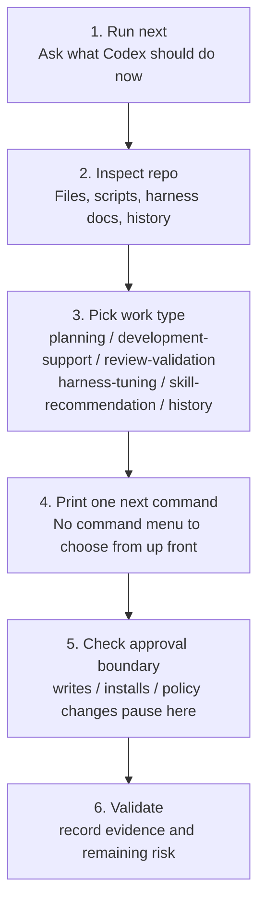

# Repo Harness Tuner

Repo Harness Tuner is a Codex workspace tuner.

Run `next` once to inspect a repo, diagnose its agent workflow, choose the next safe action, suggest validation, and recommend only the smallest useful skills or worker patterns. It plans and recommends automatically. It writes files, changes policy, or installs external skills only after explicit approval.

It is not a silent autonomous product developer. It is the layer that helps Codex keep planning, development, review, validation, and repo-local harness guidance organized as the project moves.

## Start Here

In Codex, start with one request:

```text
Use repo-harness-tuner on this repo. Tell me what Codex should do next, what validation to run, and what needs approval before any file write or install.
```

Natural-language prompts should also enter the same read-only `next` flow when a repo is open:

```text
What should I do next?
Plan this project.
Set up the structure.
Set the review and validation loop.
Define completion criteria and approval points.
Handle the next step for me, but ask before writing files or installing anything.
```

These prompts do not mean "silently edit everything." The plugin should inspect first, label whether the work is planning, development support, review, harness tuning, skill recommendation, or history, then propose one safe next action.

From the command line, start with `next`. Treat every other command as something the output may recommend later:

```powershell
python scripts\console.py next --repo C:\path\to\repo --phase active-development --domain "your project"
```

`next` is the main entry point. Use `doctor` only when you want a shorter health check:

```powershell
python scripts\console.py doctor --repo C:\path\to\repo --phase active-development --domain "your project"
```

## One-Command Flow



`next` prints five things:

- what Codex found,
- the current work type,
- the one next command,
- what needs approval,
- validation to run.

The work type is explicit: `planning`, `development-support`, `review-validation`, `harness-tuning`, `skill-recommendation`, or `history`. That keeps the output from feeling like a raw engine dump: you can see whether Codex is setting direction, supporting implementation, checking evidence, tuning the harness, recommending skills, or recording learning for the next cycle.

You do not need to choose `bootstrap`, `tune`, `factory`, `recommend-skills`, or `history` up front. Start with `next`; use the recommended action after reviewing the approval boundary.

## Harness Contract

Every generated or tuned harness should make four boundaries explicit:

- **Scope**: what Codex may own, and what it must not take over.
- **Access & Actions**: what Codex can see, what it can do, what it must not do, and what requires approval.
- **Definition of Done**: validation, changed-file summary, skipped-check reason, remaining risk, and closeout evidence.
- **Human Approval Points**: release, deployment, dependencies, CI, secrets, customer/user-facing sends, destructive changes, policy changes, and high human-involvement areas.

`next`, `doctor`, and `run-loop` expose this as `harness_contract`; `bootstrap`, `tune`, and `factory` write those sections into generated harness docs.

## Safety Model

The plugin is read-first.

- `next`, `doctor`, and default `run-loop` do not edit files.
- File writes require explicit flags such as `--write`, `--write-plan`, `--write-recommended`, or `--write-artifacts`.
- Skill installs require explicit `--install --confirm-install`.
- Human involvement levels 4 and 5 also require `--confirm-write`.
- Dependency, release, CI, secret, credential, marketplace, install/uninstall, migration, privacy-sensitive, and destructive changes require explicit approval.
- `tune` updates managed markdown sections instead of rewriting whole files.
- `bootstrap` and factory artifact writes preserve existing files unless an explicit force path is used.

## When To Use It

Use this plugin when:

- a repo needs `AGENTS.md` or `Docs/AI/*`,
- Codex is using too much or too little process,
- validation guidance, ask-before-edit rules, or worker visibility needs to be made repo-specific,
- a project would benefit from repo-specific Codex team or skill planning,
- a project should get only the smallest useful skill/agent recommendations instead of a broad external pack,
- you want history/eval evidence to guide future harness tuning.

You usually do not need it for ordinary coding, debugging, or review when the repo harness is already fit.

## Adaptive Harness Loop

Repo Harness Tuner is designed for projects that keep changing.

It tracks:

- phase-specific review cadence,
- next review triggers,
- readiness score movement,
- repeated validation drift,
- repeated process overhead,
- repeated human-involvement gaps,
- eval regressions and unchanged failures.

Those signals raise review pressure and can make the next `next` / `run-loop` pass recommend `tune`, `eval-review`, or a shorter review interval.

`next`, `doctor`, and `run-loop` also emit structured `adaptive` recommendations for cadence and human involvement. There is no background scheduler yet. Re-run `next` at the recommended trigger, after meaningful project changes, after repeated Codex misses, or before high-risk/release work.

## Skill Recommendations

`next` / `run-loop` includes minimal skill recommendations. The standalone command is:

```powershell
python scripts\console.py recommend-skills --repo C:\path\to\repo --phase active-development --domain "your project" --source builtin,ecc
```

The command ranks repo-fit capabilities such as code review, TDD, security, docs, build repair, frontend UI, and release checks. It can use the built-in factory or the ECC seed catalog, but it never bulk-installs ECC. External candidates are installed only as small Codex adapter skills after `--install --confirm-install`; hooks, MCP servers, slash commands, marketplace edits, and policy changes stay out of the automatic path.

## Human Involvement

Human involvement controls how much Codex should ask before acting.

By default, the plugin chooses a level from the project phase:

| Phase | Default |
| --- | ---: |
| `prototype` | 2 |
| `new-project` | 3 |
| `active-development` | 3 |
| `maintenance` | 3 |
| `pre-release` | 4 |
| `high-risk` | 5 |

You can override it:

```powershell
python scripts\console.py run-loop --repo C:\path\to\repo --human-involvement 4
python scripts\console.py run-loop --repo C:\path\to\repo --module "Release flow: 5"
```

Level guide:

- `1`: Codex can move autonomously unless a protected area appears.
- `2`: Codex follows repo patterns and reports assumptions.
- `3`: Codex infers from context but asks before hard-to-reverse or user-visible direction changes.
- `4`: Codex asks focused questions before edits unless the repo already answers them.
- `5`: Codex needs explicit approval before edits.

Current behavior detects human-involvement gaps and can recommend keeping, raising, or lowering the default level from history/eval evidence. It never applies that policy change silently; changing repo-local policy requires review and explicit approval.

## Core Commands

Run from this plugin directory:

```powershell
python scripts\console.py next --repo C:\path\to\repo --phase active-development --domain "your project"
python scripts\console.py doctor --repo C:\path\to\repo --phase active-development --domain "your project"
python scripts\console.py run-loop --repo C:\path\to\repo --phase active-development --domain "your project"
python scripts\console.py recommend-skills --repo C:\path\to\repo --phase active-development --domain "your project"
python scripts\console.py tune --repo C:\path\to\repo --phase active-development --dry-run --diff
python scripts\console.py bootstrap --repo C:\path\to\repo --phase new-project
python scripts\console.py fixture-test
python scripts\console.py release-check
```

Full command details and JSON examples are in [Docs/commands.md](Docs/commands.md).

## Install

For first-time install, clone to `$HOME\plugins\repo-harness-tuner`, add the personal marketplace entry, then run:

```powershell
codex plugin add repo-harness-tuner@personal
```

See [Docs/install.md](Docs/install.md) for fresh-clone setup, refresh, troubleshooting, Windows `codex.exe` shim issues, PyYAML validator setup, and validation.

## More Docs

- Korean README: [README.md](README.md)
- Install and troubleshooting: [Docs/install.md](Docs/install.md)
- Full command reference: [Docs/commands.md](Docs/commands.md)
- CLI contracts: [Docs/cli-contracts.md](Docs/cli-contracts.md)
- Versioning and breaking changes: [Docs/versioning.md](Docs/versioning.md)
- Fixture tests: [Docs/fixture-tests.md](Docs/fixture-tests.md)
- Roadmap: [ROADMAP.md](ROADMAP.md)
- Handoff for another PC/thread: [HANDOFF.md](HANDOFF.md)
