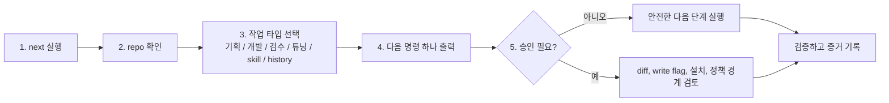

# Repo Harness Tuner

Repo Harness Tuner는 Codex 작업장 튜너입니다.

`next` 한 번으로 repo를 살펴보고, agent 작업 흐름을 진단하고, 다음 안전한 작업과 검증 방법, 필요한 최소 skill/worker 추천을 정리합니다. 분석과 추천은 자동으로 하지만, 파일 쓰기, 정책 변경, 외부 skill 설치는 명시 승인 후에만 합니다.

이 플러그인은 조용히 모든 기획/개발/출시를 대신하는 자동 개발자가 아닙니다. Codex가 기획, 개발, 검수, 문서화, 하네스 정리를 계속 이어가기 좋도록 작업장을 정리하는 층입니다.

## 시작하기

Codex에서는 이렇게 한 번 요청하세요.

```text
repo-harness-tuner로 이 repo를 봐줘. Codex가 다음에 뭘 해야 하는지, 어떤 검증을 해야 하는지, 파일 쓰기나 설치 전에 무엇을 승인해야 하는지 알려줘.
```

CLI에서는 `next`로 시작하세요. 다른 명령은 `next` 결과가 추천할 때 따라가면 됩니다.

```powershell
python scripts\console.py next --repo C:\path\to\repo --phase active-development --domain "your project"
```

`next`가 기본 진입점입니다. 짧은 건강 상태만 보고 싶다면 `doctor`를 씁니다.

```powershell
python scripts\console.py doctor --repo C:\path\to\repo --phase active-development --domain "your project"
```

## 원커맨드 흐름



`next`는 다섯 가지를 보여줍니다.

- Codex가 발견한 것
- 현재 작업 타입
- 다음 명령 하나
- 승인이 필요한 것
- 실행할 검증

작업 타입은 `planning`, `development-support`, `review-validation`, `harness-tuning`, `skill-recommendation`, `history` 중 하나로 표시됩니다. 그래서 지금 Codex가 기획을 잡는 중인지, 개발을 돕는 중인지, 검수 증거를 보는 중인지, 하네스를 조정하는 중인지 한눈에 알 수 있습니다.

처음부터 `bootstrap`, `tune`, `factory`, `recommend-skills`, `history`를 고를 필요는 없습니다. `next`로 시작하고, 출력된 승인 경계를 검토한 뒤 추천된 다음 명령만 따라가면 됩니다.

## 하네스 계약

생성되거나 튜닝되는 하네스는 네 가지 경계를 명확히 남깁니다.

- **Scope**: Codex에게 어디까지 맡길지, 어디부터 맡기지 않을지
- **Access & Actions**: Codex가 무엇을 볼 수 있고, 무엇을 할 수 있고, 무엇은 금지되며, 무엇은 승인 후 가능한지
- **Definition of Done**: 검증, 변경 파일 요약, 스킵 사유, 남은 위험, closeout 증거
- **Human Approval Points**: 릴리즈, 배포, dependency, CI, secret, 고객/사용자 발송, 파괴적 변경, 정책 변경, 높은 human-involvement 영역

`next`, `doctor`, `run-loop`는 이 내용을 `harness_contract`로 출력하고, `bootstrap`, `tune`, `factory`는 생성 문서에 이 섹션을 씁니다.

## 안전 모델

기본은 read-first입니다.

- `next`, `doctor`, 기본 `run-loop`는 파일을 수정하지 않습니다.
- 파일 쓰기는 `--write`, `--write-plan`, `--write-recommended`, `--write-artifacts` 같은 명시 플래그가 필요합니다.
- skill 설치는 `--install --confirm-install`이 필요합니다.
- human involvement 4 또는 5에서는 `--confirm-write`도 필요합니다.
- dependency, release, CI, secret, credential, marketplace, install/uninstall, migration, privacy-sensitive, destructive 변경은 명시 승인 없이는 진행하지 않습니다.
- 외부 ECC 후보는 대량 설치하지 않고, 승인된 경우 작은 Codex adapter skill로만 설치합니다.

## Skill 추천

`next` / `run-loop`에는 최소 skill 추천이 포함됩니다. 별도로 보고 싶으면:

```powershell
python scripts\console.py recommend-skills --repo C:\path\to\repo --phase active-development --domain "your project" --source builtin,ecc
```

추천 대상은 code review, TDD, security, docs, build-fix, frontend-ui, release-check 같은 역량입니다. 내장 factory로 충분한지, ECC seed catalog 후보가 필요한지 판단하지만, 추천은 1-3개로 제한됩니다.

설치하려면 반드시 검토 후 실행합니다.

```powershell
python scripts\console.py recommend-skills --repo C:\path\to\repo --install --confirm-install
```

이 설치는 Codex adapter skill만 생성합니다. ECC hooks, MCP 서버, slash command, agent 파일, marketplace 설정은 자동으로 설치하지 않습니다.

## Adaptive Harness Loop

프로젝트가 진행되면 하네스도 바뀌어야 합니다.

플러그인은 다음 신호를 봅니다.

- phase별 review cadence
- 다음 review trigger
- readiness score 변화
- 반복되는 validation drift
- 반복되는 process overhead
- 반복되는 human-involvement gap
- eval regression 또는 unchanged failure

이 신호들은 `adaptive.cadence`, `adaptive.human_involvement`, `skill_recommendations.curator`에 구조화되어 출력됩니다. 튜닝 주기나 인간개입 정책은 자동 변경하지 않고, 추천만 하며 적용은 승인 기반입니다.

## Human Involvement

human involvement는 Codex가 행동 전 얼마나 자주 물어봐야 하는지를 정합니다.

| Phase | 기본값 |
| --- | ---: |
| `prototype` | 2 |
| `new-project` | 3 |
| `active-development` | 3 |
| `maintenance` | 3 |
| `pre-release` | 4 |
| `high-risk` | 5 |

직접 조정할 수 있습니다.

```powershell
python scripts\console.py run-loop --repo C:\path\to\repo --human-involvement 4
python scripts\console.py run-loop --repo C:\path\to\repo --module "Release flow: 5"
```

## 핵심 명령

```powershell
python scripts\console.py next --repo C:\path\to\repo --phase active-development --domain "your project"
python scripts\console.py doctor --repo C:\path\to\repo --phase active-development --domain "your project"
python scripts\console.py run-loop --repo C:\path\to\repo --phase active-development --domain "your project"
python scripts\console.py recommend-skills --repo C:\path\to\repo --phase active-development --domain "your project"
python scripts\console.py tune --repo C:\path\to\repo --phase active-development --dry-run --diff
python scripts\console.py bootstrap --repo C:\path\to\repo --phase new-project
python scripts\console.py fixture-test
python scripts\console.py release-check
```

전체 명령과 JSON 예시는 [Docs/commands.md](Docs/commands.md)에 있습니다.

## 설치

처음 설치할 때는 `$HOME\plugins\repo-harness-tuner`에 clone하고 personal marketplace entry를 추가한 뒤 실행합니다.

```powershell
codex plugin add repo-harness-tuner@personal
```

fresh clone, 갱신, 문제 해결, Windows `codex.exe` shim, PyYAML validator, 검증 절차는 [Docs/install.md](Docs/install.md)를 보세요.

## 관련 문서

- English README: [README.md](README.md)
- 설치와 문제 해결: [Docs/install.md](Docs/install.md)
- 전체 명령: [Docs/commands.md](Docs/commands.md)
- CLI 계약: [Docs/cli-contracts.md](Docs/cli-contracts.md)
- 버전/변경 정책: [Docs/versioning.md](Docs/versioning.md)
- Fixture tests: [Docs/fixture-tests.md](Docs/fixture-tests.md)
- 로드맵: [ROADMAP.md](ROADMAP.md)
- 다른 PC/thread에서 이어가기: [HANDOFF.md](HANDOFF.md)
